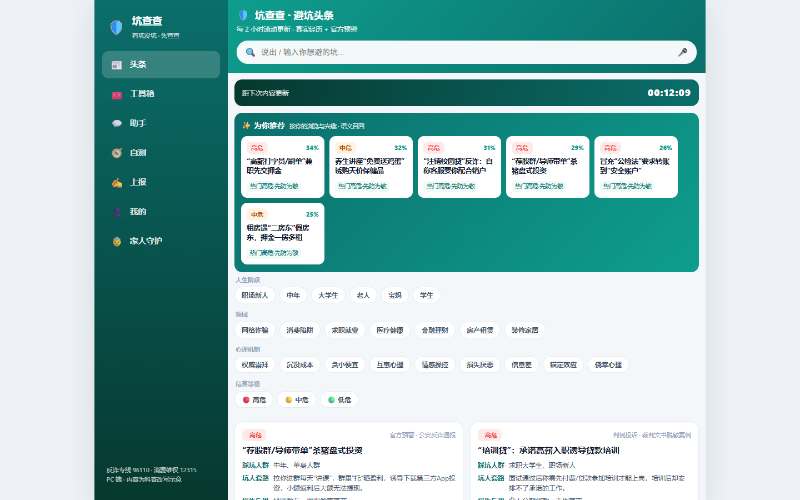
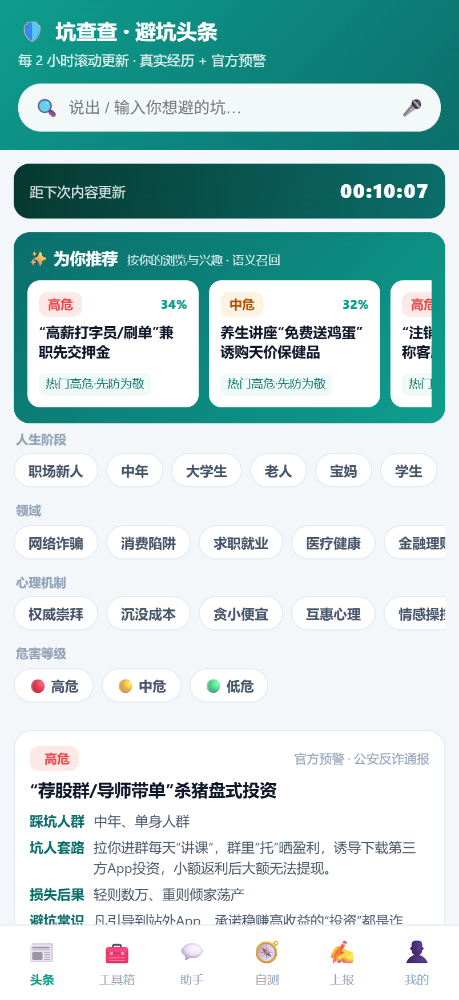
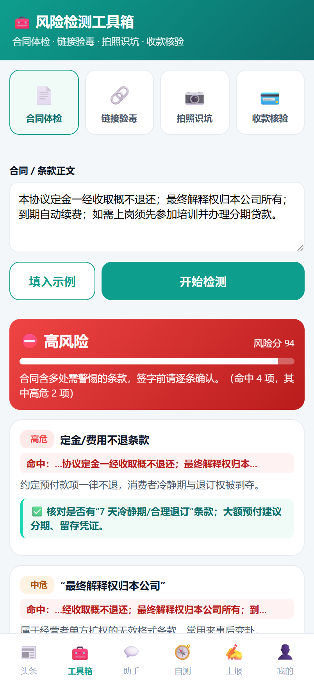
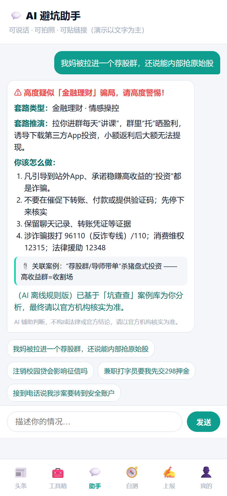
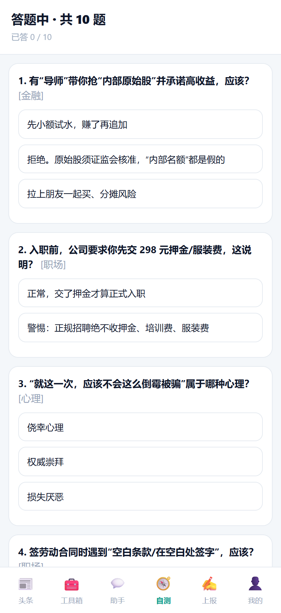
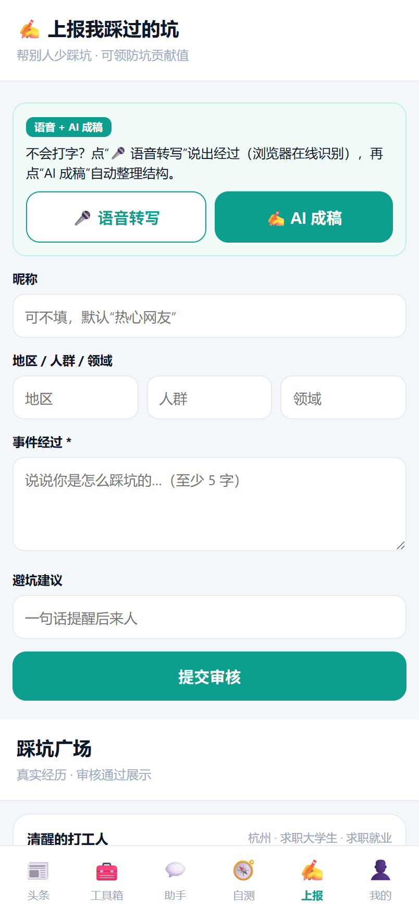
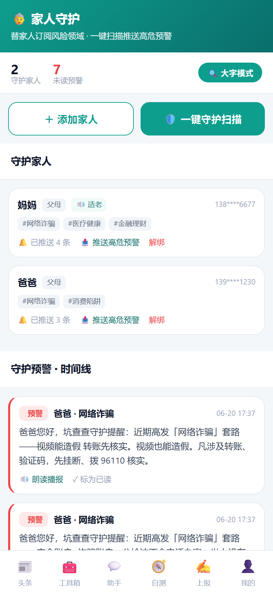
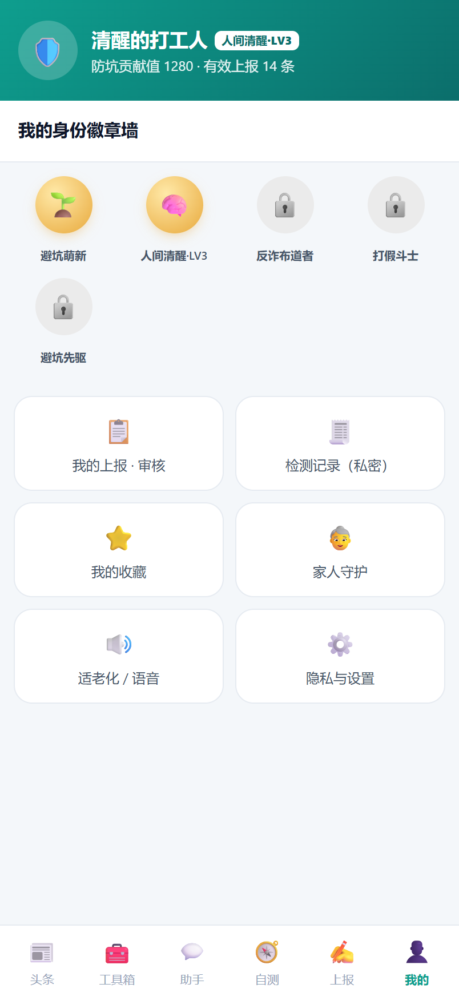

# 坑查查（KENG CHACHA）· 生活防坑与常识科普平台

> **有坑没坑，先查查。** 一个把「反诈 / 防坑 / 消费维权」常识做成**可查、可测、可分享、可守护**的科普平台。
> 本仓库是依据《坑查查-产品需求文档PRD.md》《坑查查-技术实现方案.md》《坑查查-原型设计.html》落地的**可运行 MVP**（V1.0）。

<p align="center">
  <a href="https://github.com/topbat/kengchacha-app/actions/workflows/ci.yml">
    
  </a>
  
  
  
</p>

---

## 一、产品一览

坑查查围绕「**遇到可疑信息时，第一时间能查、能问、能测**」设计，覆盖从**主动学习**到**实时检测**再到**家人守护**的完整链路：

- 📰 **看** —— 每 2 小时滚动更新的「避坑头条」，五维标签精准筛选 + 语义化「为你推荐」
- 🧰 **查** —— 合同 / 链接 / 截图 / 收款四合一「风险检测工具箱」，一键出风险分
- 💬 **问** —— AI 避坑助手，结构化拆解套路并给出官方处置渠道
- 🧭 **测** —— 防坑能力自测，输出六维画像与高危场景预警
- ✍️ **报** —— 语音 + AI 成稿的踩坑上报，沉淀真实案例
- 👵 **护** —— 为家人订阅风险领域，自动生成适老化口播预警

> 内容均为**科普改写示意**，不点名定性具体企业；AI 输出标注"不构成法律/官方结论"。

### 桌面端（PC）一览

同一套 React 应用响应式适配：窗口 ≥980px 自动切换为「左侧导航 + 宽屏双列信息流」的桌面布局。



---

## 二、产品模块与功能介绍

> 移动端（H5）为主形态；下列每个模块均为**可运行垂直切片**，截图取自真实运行实例。

### 1. 📰 避坑头条 · 智能信息流

每 2 小时滚动更新的科普资讯流。支持「**领域 / 人群 / 危害 / 地域 / 时效**」五维标签筛选与关键词搜索；顶部「✨为你推荐」基于浏览足迹与兴趣标签做**语义召回**（可解释）；每张卡片可「🔊听一听 / 🔗相似坑 / 🖼生成海报」。

`GET /api/content/feed` · `/api/content/{id}` · `/api/content/tags` · `/api/refresh/countdown` · `GET /api/recommend/similar/{id}` · `POST /api/recommend/for-you`



### 2. 🧰 风险检测工具箱 · 四合一

把「拿不准的东西」直接丢进来出结论，四类检测器 + 私密检测记录（仅脱敏预览）：

- **合同体检** —— 风险条款标红（定金不退 / 自动续费 / 空白条款 / 培训贷 / 高额违约金）
- **链接验毒** —— 仿冒域名、IP 直连、诱导词识别
- **拍照识坑** —— 诈骗话术分类（支持 🎤 口述截图文字）
- **收款核验** —— 公对私、户名不符等异常提示

`POST /api/toolbox/contract` · `/link` · `/image` · `/payee` · `GET /api/toolbox/records`



### 3. 💬 AI 避坑助手

规则版 RAG（案例库召回）+ 固定五段式作答：**风险判定 → 套路拆解 → 你该怎么办 → 官方渠道（96110/110/12315） → 关联案例**，并附免责声明。`LlmClient` 接口已预留云大模型接入。

`POST /api/assistant/chat`



### 4. 🧭 防坑能力自测

出题（不下发答案）→ 评分 → 维度短板分析 → 防坑画像 / 高危场景 / 行动建议。覆盖**心理 / 法律 / 消费 / 金融 / 职场 / 网络**六大维度，支持快测 10 题 / 标准 30 题 / 深度 50 题。

`GET /api/quiz/start` · `POST /api/quiz/submit`



### 5. ✍️ 踩坑上报 · UGC

「不会打字？」点 🎤 语音转写说出经过 → 「AI 成稿」自动整理结构 → 提交（含 AI 审核占位）→ 「踩坑广场」展示审核通过案例，可点赞「学到了 / 点亮」。

`GET/POST /api/ugc/stories` · `POST /api/ugc/stories/{id}/like`



### 6. 👵 家人守护

为家人订阅关心的风险领域 → 「🛡️一键守护扫描」按订阅生成**适老化口播预警** → 「🔊朗读播报」，支持「🔍大字模式」、绑定 / 解绑 / 已读。

`GET /api/guardian/overview` · `POST /api/guardian/relations` · `/push-all` · `/relations/{id}/push` · `POST /api/guardian/alerts/{id}/read`



### 7. 👤 我的 · 成长与徽章

防坑贡献值、身份等级、徽章墙（避坑萌新 / 人间清醒 / 反诈布道者 / 打假斗士…）；聚合「我的上报、检测记录、收藏、家人守护、适老化语音、隐私设置」入口。

`GET /api/growth/me`



### 8. 🖼 文生图海报 / 🔊 语音 ASR-TTS（横切能力）

- **文生图海报**：结构化要素 → 服务端 SVG 模板渲染（标题/套路/损失/口诀 + 程序化插画背景 + 仿二维码），多端排版一致，前端可下载 SVG/PNG。`POST /api/share/poster`
- **语音 ASR/TTS**：在线优先走浏览器 Web Speech（语音搜索 / 转写上报 / 朗读播报）；离线/兜底经 `VoiceClient`，TTS 返回确定性 WAV + SSML。`POST /api/voice/asr` · `/tts`

> 上述能力沿用「**离线规则/确定性 + 接口隔离**」范式：`LlmClient` / `EmbeddingClient` / `VoiceClient` 三类抽象 + `@ConditionalOnProperty` 切换 —— 开发期**零密钥可跑**，切生产仅换实现（云大模型 / BGE-M3E / 讯飞·阿里云语音 / pgvector·Milvus），上层不变。

---

## 三、模块与接口速查表

| 模块 | 核心能力 | 主要接口 |
|------|------|------|
| 避坑头条 | 五维标签筛选 + 搜索 + 分页；2 小时更新倒计时 | `GET /api/content/feed`、`/{id}`、`/tags`、`/api/refresh/countdown` |
| 风险检测工具箱 | 合同 / 链接 / 拍照 / 收款 四检测器 + 私密记录 | `POST /api/toolbox/{contract,link,image,payee}`、`GET /api/toolbox/records` |
| AI 避坑助手 | 规则 RAG + 五段式作答 + 官方渠道 | `POST /api/assistant/chat` |
| 防坑自测 | 出题 → 评分 → 六维画像 | `GET /api/quiz/start`、`POST /api/quiz/submit` |
| 踩坑上报 UGC | 语音转写 + AI 成稿 + 审核 + 广场点赞 | `GET/POST /api/ugc/stories`、`POST /api/ugc/stories/{id}/like` |
| 家人守护 | 订阅 → 扫描 → 适老化预警 | `GET /api/guardian/overview`、`POST /api/guardian/relations`·`/push-all` |
| 成长 / 徽章 | 成长概览 + 徽章解锁 | `GET /api/growth/me` |
| 向量检索 / 推荐 | 相似案例 + 为你推荐（可解释） | `GET /api/recommend/similar/{id}`、`POST /api/recommend/for-you` |
| 文生图海报 | 服务端 SVG 渲染，可下载 | `POST /api/share/poster` |
| 语音 ASR / TTS | Web Speech 优先 + 离线兜底 | `POST /api/voice/asr`·`/tts` |
| PC 端 | ≥980px 响应式桌面布局 | 复用全部上述接口 |

---

## 四、技术栈

- **后端**：Java 21（虚拟线程）+ Spring Boot 3.2 + Spring Data JPA + **H2 内存库（PostgreSQL 兼容模式）**，Maven 构建；按 `content/quiz/ugc/assistant/growth/refresh/toolbox/guardian/media/voice/recommend` 分模块（模块化单体，即未来微服务边界）。
- **前端**：Vite 6 + React 18 + TypeScript + react-router；`/api` 代理到后端；同一套代码 H5 + PC 响应式。
- **数据初始化**：`schema.sql` 建表 + `data.sql` 种子（避坑内容含五维标签、自测题库、徽章、示例 UGC）。
- **切生产**：依赖均经接口隔离，按 Profile 切 PostgreSQL+pgvector / Redis / ES / 云大模型（`LlmClient`）。
- **CI**：GitHub Actions（`.github/workflows/ci.yml`）—— 后端 `mvn verify`（编译·测试·打包并归档 jar）+ 前端 `tsc --noEmit` + `vite build`（归档 dist）。

---

## 五、目录结构

```
kengchacha-app/
├── backend/                 Spring Boot 后端
│   ├── pom.xml
│   └── src/main/
│       ├── java/com/kengchacha/
│       │   ├── common/      统一响应 / 全局异常 / CORS
│       │   ├── content/     避坑头条（含五维标签）
│       │   ├── refresh/     2 小时更新倒计时
│       │   ├── quiz/        防坑自测与画像
│       │   ├── ugc/         踩坑上报
│       │   ├── assistant/   AI 避坑助手（LlmClient 抽象 + Mock）
│       │   ├── growth/      成长与徽章
│       │   ├── toolbox/     风险检测工具箱（4 检测器 + 私密记录）
│       │   ├── guardian/    家人守护（关系/订阅/预警推送）
│       │   ├── media/       文生图海报（服务端 SVG 渲染）
│       │   ├── voice/       语音 ASR/TTS（VoiceClient 抽象 + Mock）
│       │   └── recommend/   向量检索/个性化推荐（EmbeddingClient + 向量索引）
│       └── resources/       application.yml / schema.sql / data.sql
├── frontend/                Vite + React H5 + PC 端响应式
│   └── src/{api.ts, App.tsx, styles.css, voice.ts, recent.ts,
│            components/PosterModal.tsx, pages/{Feed,Toolbox,Guardian,Assistant,Quiz,Report,Me}.tsx}
├── docs/screenshots/        README 截图
├── 坑查查-产品需求文档PRD.md
├── 坑查查-技术实现方案.md
├── 坑查查-原型设计.html
├── 坑查查-LOGO.html / 坑查查-logo.svg
└── README.md（本文件）
```

---

## 六、快速开始

### 1）启动后端（端口 8080）
```bash
# 方式一：直接跑（需联网首次拉依赖）
mvn -f backend/pom.xml spring-boot:run

# 方式二：打包后运行
mvn -f backend/pom.xml -DskipTests package
java -jar backend/target/kengchacha-backend-2.0.0.jar
```
- 健康自检：浏览器或 curl 访问 `http://localhost:8080/api/refresh/countdown`
- H2 控制台：`http://localhost:8080/h2-console`（JDBC URL：`jdbc:h2:mem:kengchacha`，用户 `sa`，空密码）

### 2）启动前端（端口 5173）
```bash
cd frontend
npm install
npm run dev      # 打开 http://localhost:5173
```
> 前端通过 Vite 代理把 `/api/*` 转发到 `http://localhost:8080`，**请先启动后端**。

### 3）生产构建（可选）
```bash
npm --prefix frontend run build   # 产物在 frontend/dist
```

---

## 七、快速体验路径

1. **头条**：顶部🎤语音搜索或点"领域→网络诈骗""危害→高危"五维筛选；顶部"✨为你推荐"按浏览/兴趣语义召回（点一条会自适应刷新）；卡片可"🔊听一听 / 🔗相似坑 / 🖼海报"。
2. **工具箱**：选「合同体检」点"填入示例"→"开始检测"看风险条款标红；「链接验毒」填示例 `taobao-anquan.cn` 看仿冒命中；底部"🧾检测记录（私密）"仅存脱敏预览。
3. **AI 助手**：点示例"我妈被拉进一个荐股群…"，看五段式结构化作答 + 关联案例 + 96110 提示。
4. **自测**：快测 10 题 → 提交 → 看防坑画像、六维条形图、高危场景与建议。
5. **上报**：点"🎤 语音转写"在线识别口述经过 → "✍️ AI 成稿"整理 → 提交 → 踩坑广场点赞。
6. **我的 → 家人守护**：添加家人并订阅风险领域 → "🛡️一键守护扫描"按订阅生成适老化预警 → "🔊朗读播报"；可开"🔍大字模式"。
7. **PC 端**：浏览器窗口拉宽到 ≥980px，自动切换为左侧导航 + 宽屏双列布局。

> 语音（ASR/TTS）在线优先走浏览器 Web Speech API（Chrome/Edge 支持最佳）；不支持时回退后端离线实现。

---

## 八、说明
- 所有内容为**科普改写示意**，不点名定性具体企业；AI 输出标注"不构成法律/官方结论"。
- Windows PowerShell 直接 `Invoke-RestMethod` 看接口可能显示中文乱码（PS5.1 解码问题），浏览器/`curl.exe` 正常。
